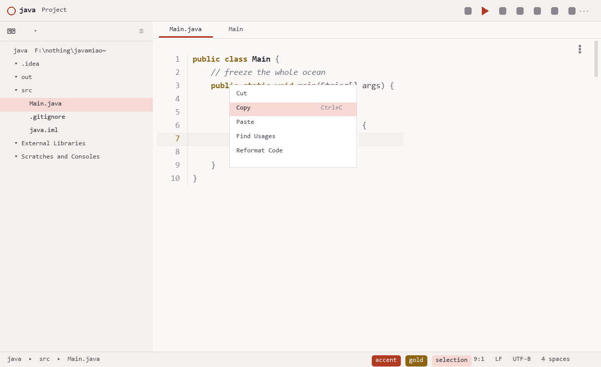
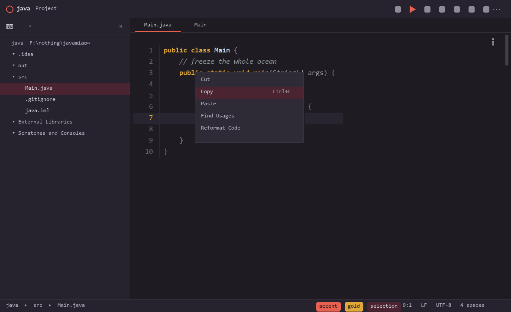
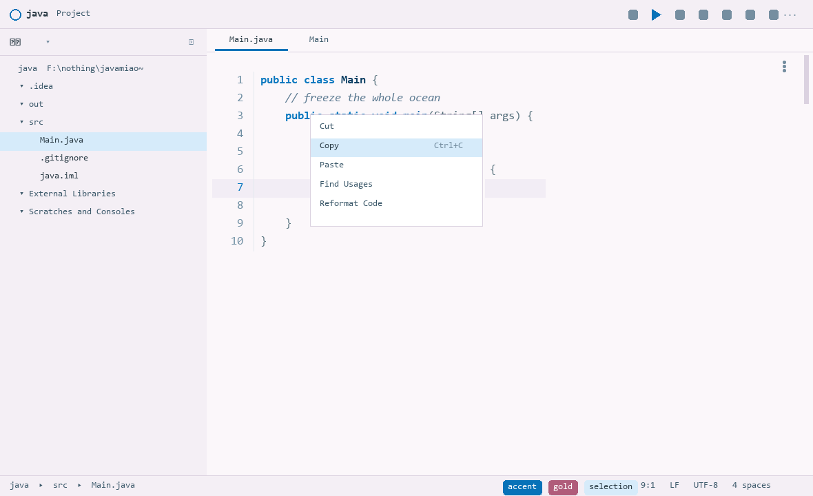
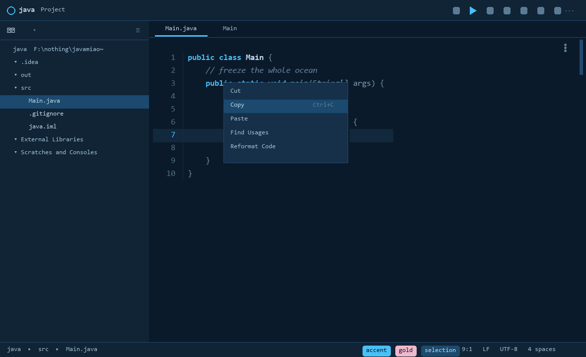
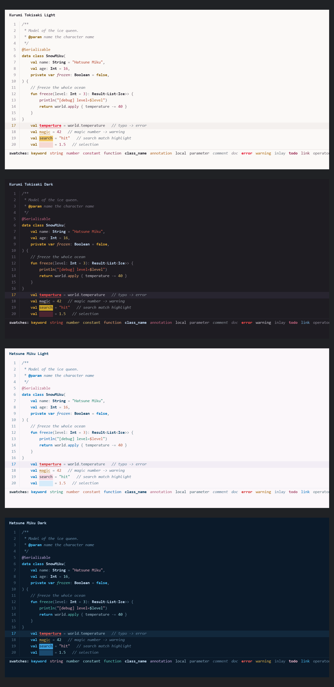

# IntelliJ IDEA 主题 × 4（时崎狂三 / 初音未来）

从两张动漫原图的实测像素提取配色，做成四套 IntelliJ IDEA 主题。IDE 框架与编辑器配色都包含，
选中一套即整套生效。Blender 版本是独立仓库 `blender-anime-themes`（本机与
`../blender-anime-themes/` 并列）——两边共用同一套角色色值，Blender 文本编辑器的
**8 个语法高亮属性与本配色方案逐字节一致**，由 `extract_palettes.py` 把调色板提取过去。

| 主题 | 基调 | 编辑器底色 | 关键字 | 字符串 |
|---|---|---|---|---|
| Kurumi Tokisaki Light | 暖白 | `#FBF9F7` | `#8C6414` 金 | `#B03A22` 朱红 |
| Kurumi Tokisaki Dark | 炭黑带紫 | `#1E1C22` | `#E0A838` 金 | `#E8604F` 朱红 |
| Hatsune Miku Light | 暖粉白 | `#FBF7FA` | `#0777BF` 天蓝 | `#1D8169` 深青 |
| Hatsune Miku Dark | 深海蓝 | `#0B1A2A` | `#48C0F8` 亮青 | `#F0B8CC` 玫瑰 |

## 交付物

| 文件 | 大小 | 说明 |
|---|---|---|
| [`dist/AnimeIDEAThemes.jar`](dist/AnimeIDEAThemes.jar) | 24,081 B | **界面主题插件**，含 4 套 UI 主题 + 4 套编辑器配色 |
| `KurumiTokisaki_Light.icls` 等 4 个 | 各约 46 KB | 编辑器配色方案，只换代码配色时用 |
| `preview.png` / `preview_*.png` | — | 编辑器配色代码效果图 |
| `ui_preview.png` / `ui_preview_*.png` | — | 完整界面模拟图（项目树、标签页、状态栏、弹窗） |
| `PALETTE.md` | — | 生成器输出的最终色值与实测对比度（勿手改） |
| `SPEC.md` | — | 设计规格与决策记录 |

## 预览

下面是四套主题的**完整界面模拟**——项目树、标签页、工具栏、状态栏、弹窗、滚动条都在主题范围内
（这正是只装 `.icls` 时看不到的那部分）：

| | |
|---|---|
| **Kurumi Tokisaki Light**<br> | **Kurumi Tokisaki Dark**<br> |
| **Hatsune Miku Light**<br> | **Hatsune Miku Dark**<br> |

编辑器配色的代码实际渲染效果，四套叠放（2× 分辨率）：



单套高分辨率图：`preview_KurumiTokisakiLight.png`、`preview_KurumiTokisakiDark.png`、
`preview_HatsuneMikuLight.png`、`preview_HatsuneMikuDark.png`；
单套界面模拟：`ui_preview_*.png`；汇总图：`ui_preview.png`。
另有一份可交互的 `preview.html`。

## 装哪个？——先弄清 `.icls` 的边界

**`.icls` 只能改编辑器**：代码高亮、行号、光标行、控制台、diff、搜索结果。
项目树、标签页、工具栏、状态栏、运行窗口、滚动条、图标这些属于**界面主题**，`.icls` 碰不到。
只装 `.icls` 会感觉「只有编辑器和控制台变了」，这不是没生效，是它的能力边界。

| 想要的效果 | 装什么 |
|---|---|
| 只换代码配色 | 4 个 `.icls` 放进配置目录的 `colors\` |
| 连 IDE 框架一起换 | `dist\AnimeIDEAThemes.jar`（内含 4 套 UI 主题 + 4 套配色方案） |

## 安装 A：只用编辑器配色

把 `.icls` 复制到对应 IDE 配置目录下的 `colors\` 子目录（不存在就新建），重启 IDE：

```bash
mkdir -p "/c/Users/kb/AppData/Roaming/JetBrains/IdeaIC2025.2/colors"
cp *.icls "/c/Users/kb/AppData/Roaming/JetBrains/IdeaIC2025.2/colors/"
```

然后 `Settings → Editor → Color Scheme` 选一套。

## 安装 B：界面主题插件（推荐）

1. `Settings → Plugins → ⚙ → Install Plugin from Disk…` → 选 `dist\AnimeIDEAThemes.jar`
2. **重启 IDE**
3. `Settings → Appearance & Behavior → Appearance → Theme` 里选四套之一

本机已装好一份，位置 `%APPDATA%\JetBrains\IdeaIC2025.2\plugins\AnimeIDEAThemes\lib\`，
校验值与下方表格一致，重启后即可在主题列表看到。

**插件没有签名**，IDEA 可能提示未签名。jar 里**没有一行可执行代码**（只有 JSON、XML 和一个
SVG 图标），继续即可。

**如果编辑器配色没跟着变**：到 `Settings → Editor → Color Scheme` 手动选同名方案——
4 套配色也打包在插件里，会出现在下拉列表（显示为只读的内置方案）。

### 为什么第一版 jar 装不上

`META-INF/MANIFEST.MF` 缺失。IDEA 对没有清单文件的 jar 直接判定「不是有效插件」。
另外两处也与能装的插件不一致：`.theme.json` 与配色文件我放进了 `themes\`、`colors\` 子目录，
而能用的插件都放在 **jar 根目录**（`editorScheme` 写作 `/_名字_.xml`）。
现在三处都对齐了，`themes.py` 的 `verify_jar()` 会校验清单存在且以 `Manifest-Version: 1.0` +
CRLF 开头、`plugin.xml` 是合法 XML、每个 `themeProvider` 的 `path` 与每个 `editorScheme`
都能在 jar 内解析到、`dark` 与 `parentTheme` 一致。

## 内容规模

- **编辑器**：每套 38 个颜色项 + 284 个文本属性。Java/Kotlin 深度调校，Python、JS/TS、
  Groovy、JSON、XML、HTML、YAML、Properties、Markdown、SQL、Gherkin 一致覆盖；
  另含行号、缩进参考线、空白字符、匹配/不匹配括号、折叠、内联提示、参数提示、面包屑、
  断点、执行点、书签、搜索命中（读/写分离）、标识符高亮（读/写分离）、diff 增删改、
  控制台分级日志。
- **界面**：约 60 个组件（窗口、标签页、工具窗、工具栏、状态栏、列表、树、表格、按钮、
  输入框、弹窗、菜单、通知、链接、进度条、搜索、补全、参数提示、提示气泡、版本控制、
  书签、滚动条）。

## 设计取舍

**狂三的暖色很密集。** 关键字金色、注解与转义赭金、警告琥珀同属金色族；字符串朱红、
函数名与数字为酒红/树莓。这是「金色关键字」的必然结果——红色完全让给了错误提示。
若觉得金色族太挤，可把注解移到冷色（源图发梢的冷蓝灰 `#8E959E`/`#C2D8F2` 有依据），
改 `roles.py` 里 4 条 `annotation` 即可。

**初音浅色的关键字是 `#0777BF` 而非源图的亮天蓝 `#0890E8`。** 亮天蓝在近白底上对比度只有
3.21，达不到可读性下界；`#0777BF` 是保持色相与饱和度、只压明度后满足要求的最亮值。

**初音深色的底色 `#0B1A2A`、注解淡紫 `#C8B0E8` 是衍生的**，源图完全没有暗部。

**狂三深色的警告文字沿用默认文本色**，只靠琥珀色波浪下划线标示——关键字已占用金色。

**界面主题只改颜色，不改 UI 类名与度量。** `Button.border`、`Component.arc` 这类交给
`parentTheme` 继承：那些实现类名跨版本易变，写死会导致控件渲染异常，而颜色键名是稳定的。

## 可读性保证

生成器对每个前景色强制 WCAG 对比度下界，不达标只调明度（保色相与饱和度）：

| 类别 | 下界 |
|---|---|
| 编辑器一般前景（关键字、字符串、函数名……） | 4.5 |
| 注释、文档注释、弱警告、内联提示 | 3.9（刻意压低，注释应退到背景里） |
| 行号 | 3.2 |
| 彩色底上的前景（断点、搜索命中、参数提示） | 4.5，按**实际底色**核算而非编辑器底色 |
| 界面主文字 / 按钮文字 / 选区文字 | 4.5；界面次级文字 3.0（禁用态本就该淡） |

## 重新生成

色值改 `roles.py`（编辑器）与 `themes.py` 的 `PALETTES`（界面），然后：

```bash
python build_themes.py     # 4 个 .icls + PALETTE.md；打印对比度调整记录
python verify.py           # .icls 结构校验：颜色段/属性段分离、无重名、属性名与规格一致
python verify_render.py    # 渲染校验：逐词元回读像素，必须命中声明的颜色
python themes.py           # 4 个 .theme.json + plugin.xml + dist/AnimeIDEAThemes.jar
python preview.py          # 编辑器配色预览图
python ui_preview.py       # 完整界面模拟图
```

**构建可复现**：zip 条目时间戳被固定，相同输入产出相同字节，连续两次构建哈希一致。
所以下面的校验值可以用来确认文件有没有被动过：

```bash
python -c "import hashlib;print(hashlib.sha256(open('dist/AnimeIDEAThemes.jar','rb').read()).hexdigest())"
```

## 校验值

| 文件 | SHA-256 |
|---|---|
| `dist/AnimeIDEAThemes.jar` | `6e08439ab9614dc0bd629e01a81fa9a654950b4987f23fe9a56da4ea9229f1d1` |
| `KurumiTokisaki_Light.icls` | `fd7feaabc7f1f75c2668a874bb4e068a05841cbb078a8b5fe156521c6d4ef950` |
| `KurumiTokisaki_Dark.icls` | `64f31ddc5d1724df8cd994ec8ca9fb58850cc10635e901194a379fbc98da60e9` |
| `HatsuneMiku_Light.icls` | `81ca8462296b902b6a04bb874c4f55959b1c31ec8160c475b6788d7b31290faa` |
| `HatsuneMiku_Dark.icls` | `97b0812a5a1b08359388386a7f5b162c6f20f843a1aa21e636842f6ef3abae53` |

## 属性名与键名不是猜的

IDEA 会**静默忽略**它不认识的属性名和键名，症状是「那部分没生效」而不是报错。
所以每个名字都对照本机 IntelliJ IDEA 2025.2 (IC-252.28539.97) 自带的资源核对过：

| 来源 | 用途 |
|---|---|
| `lib/app-client.jar` → `themes/Light.xml`、`themes/expUI/expUI_darkScheme.xml` | 编辑器属性名 |
| `lib/app.jar` → `colorSchemes/XmlDarcula.xml`；各插件 `colorSchemes/*.xml` | 语言插件属性名 |
| `lib/app-client.jar` → `themes/*.theme.json` | 界面键名；导出为 `_ref/ui_keys.json`（顶层 231 + 叶子属性 680） |

核对中改正的错误：`MATCHED_BRACES`→`MATCHED_BRACE_ATTRIBUTES`、
`WHITE_SPACES`→`WHITESPACES`、`SEARCH_MATCH_ATTRIBUTES`→`SEARCH_RESULT_ATTRIBUTES`、
`MARKDOWN_HEADER_LEVEL_1..6`→`MARKDOWN_HEADER`、`XML_PROLOG`→`XML_PROLOGUE`、
`METHOD_SEPARATORS`→`METHOD_SEPARATORS_COLOR`、`BREADCRUMBS_INLAY`→`BREADCRUMBS_INACTIVE`、
界面侧的 `remoteIconColor`→`remoteBranchIconColor`；所有 `*_ATTRIBUTES` 项从颜色段移到属性段；
不存在的 `READ_IDENTIFIER_UNDER_CARET_ATTRIBUTES` 与 `INLAY_HINTS_*` 删除。

`verify_render.py` 会把每套方案画到画布上、逐词元回读像素——它曾纠正过我一次肉眼误判
（深色版的类型名在缩略图里看着是黑的，实测是正常浅蓝）。

## 不包含

- **图标图形**：主题只改颜色，图标集来自 IDEA 内置（深色继承 Darcula、浅色继承 IntelliJ，
  因此 `dark` 标记必须与 `parentTheme` 一致，生成器会校验）。
- **编辑器背景图**：`.icls` 与主题键都设不了，用 IDEA 自带的
  `Settings → Appearance & Behavior → Appearance → Background Image` 指向原图并调透明度。
